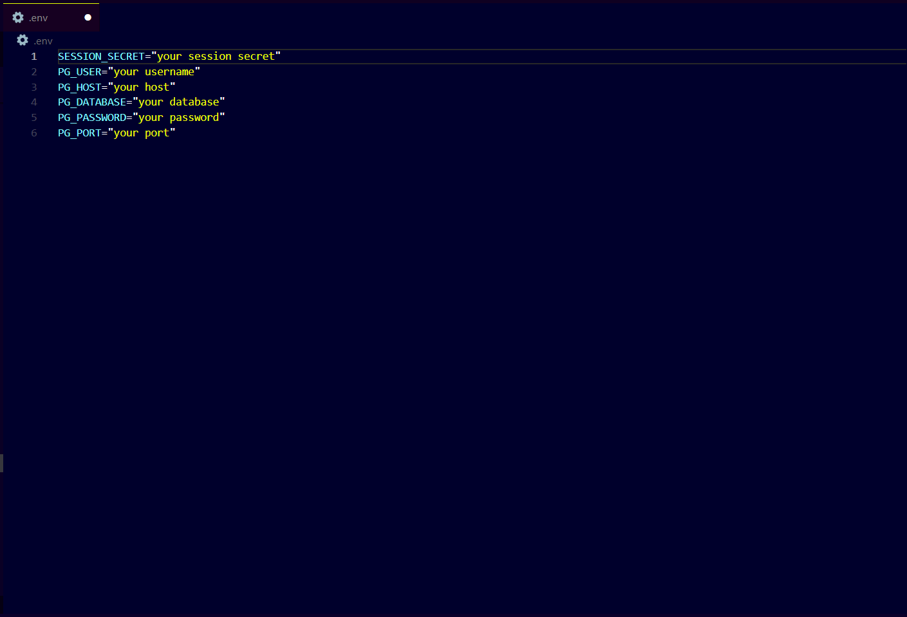

# BooKeeper 🔖

Bookeeper provides a platform for storing and organising all your book notes at one place. It help readers to make the most out of their reading experience by providing a platform to capture insights, organising thougths and engage with the content on a deeper level.


## Features ⭐

- Create a personal library of books you've read. Each book entry should include details such as title, author, isbn-13(for fetching book image).
- Effortless note taking makes it easy to capture key insights,quotes and thoughts as you read.
- Website is accessible and user-friendly across various devices, including desktops, tablets, and smartphones.
- Each user's data is safe and secure with robust encryption and privacy measures(Bookeeper uses bcryptjs for encryption of user passwords).


## Local Database Setup 💻
Follow these steps:

1.Download and install postgreSql on your local machines.


2.Create a database using pgadmin.


3.Use the following sql commands to create the tables required:


4.Setup your environment variables by creating .env file and fill in necessary values


    
## Run Locally

Clone the project

```bash
  git clone https://github.com/Airaad/bookeeper.git
```

Go to the project directory

```bash
  cd my-project
```

Install dependencies

```bash
  npm install
```

Start the server

```bash
  node app.js
```


## Screenshots


